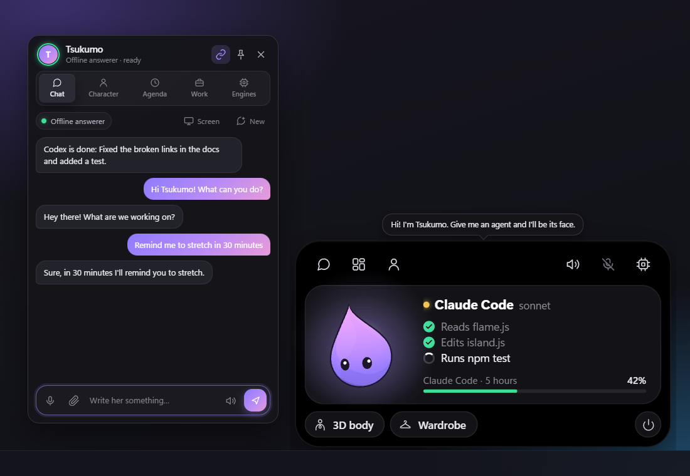
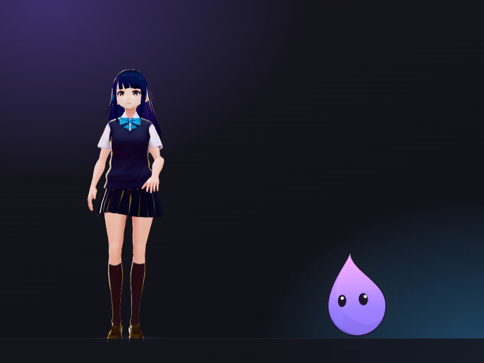
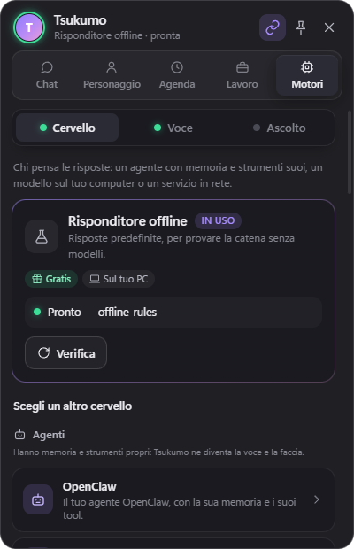

<p align="center"></p>

# Tsukumo

**Give your AI agent a body.** Tsukumo is a 3D desktop companion that becomes
the face and voice of whatever brain you plug in: Claude Code, Codex, Gemini
CLI, OpenClaw, Antigravity, a local model in LM Studio or Ollama, or a cloud
API. It lives on your desktop as a VRM character (or a small spirit flame),
talks with lip-synced local text-to-speech, listens when you speak, and taps
you on the shoulder when your agents finish their work.

> *In Japanese folklore, **tsukumogami** are objects that come alive after a
> hundred years. Tsukumo does the same to your desk, without the wait.*

[](https://github.com/Ananas2916/tsukumo/releases/latest)
[](LICENSE)




**Download (Windows 10/11):** grab the latest `Tsukumo Setup <version>.exe`
from [Releases](https://github.com/Ananas2916/tsukumo/releases/latest). No
Python or Node needed. The installer is not code-signed, so SmartScreen asks
once: *More info → Run anyway*.

---

## At a glance

| | |
|---|---|
| **What** | Desktop companion: VRM avatar + voice + ears, driven by any LLM or agent |
| **Brains** | 27 engines: 18 agents (Claude Code, Codex, Gemini CLI, OpenClaw, Antigravity, Cursor CLI, GitHub Copilot CLI, OpenCode, Qwen Code, Amp, Goose, Crush, Factory Droid, Continue CLI, Kiro CLI, Cline, Hermes Agent, any CLI command), 2 local servers (LM Studio / any OpenAI-compatible server, Ollama), 7 cloud APIs (Claude, Gemini, Groq, OpenRouter, DeepSeek, Mistral, Together) |
| **Voices** | 11 engines: Kokoro (default, local), Kokoro-FastAPI, Piper, Chatterbox (voice cloning), Windows voices, ElevenLabs, OpenAI, Azure, Google Cloud, Cartesia, Edge |
| **Ears** | Faster-Whisper (local), whisper.cpp server, Whisper API, browser speech recognition |
| **Privacy** | Everything runs locally by default. Cloud engines are an explicit choice in the panel, never a default |
| **Stack** | Python 3.10+ (FastAPI, ONNX Runtime) · Three.js + @pixiv/three-vrm · Electron 44 |
| **Interfaces** | WebSocket `ws://127.0.0.1:8770/ws` · REST `http://127.0.0.1:8770/api/*` · OpenAPI docs at `/docs` |
| **Platforms** | Windows 10/11 (full desktop mascot); macOS/Linux run the backend and the browser UI |
| **License** | AGPL-3.0 |

The in-app panel is currently in Italian. Replies, reminders, voice lines and
spontaneous comments work in English and Italian, and the reply language
follows the chosen voice. Translating the panel is a great first contribution.

---

## Contents

1. [Why Tsukumo](#why-tsukumo)
2. [Install](#install)
3. [Choosing a brain](#choosing-a-brain)
4. [Voices and listening](#voices-and-listening)
5. [The desktop mascot](#the-desktop-mascot)
6. [The assistant: reminders, comments, notifications](#the-assistant-reminders-comments-notifications)
7. [On your phone](#on-your-phone)
8. [Security](#security)
9. [For AI agents and integrators](#for-ai-agents-and-integrators)
10. [Configuration](#configuration)
11. [How the lip-sync works](#how-the-lip-sync-works)
12. [Project layout](#project-layout)
13. [Troubleshooting](#troubleshooting)
14. [Contributing](#contributing)
15. [License](#license)

---

## Why Tsukumo

- **One body, any brain.** Agents keep their own memory, tools and personality;
  Tsukumo only adds a voice, a face and the rules of speech (language, no
  markdown read aloud). Switch from Claude Code to a local Ollama model from the
  panel and she stays the same character, with the same name and memories.
- **She tells you what the agent is doing.** While an agent works, its tool
  calls become readable steps ("reading main.js", "running git status") in a
  speech bubble, and her pose changes: a holographic tablet when the agent
  reads, a keyboard when it writes.
- **She watches your agents for you.** Claude Code and Codex running in your own
  terminal or VS Code ping her when they finish or need permission. If you're
  elsewhere she knocks on the screen and says it; if you're already looking at
  the editor, a bubble is enough.
- **Usage limits at a glance.** Claude Code and Codex plan limits and today's
  tokens, read from local files only. No network, no credentials.
- **Starts speaking before the model finishes.** Replies are streamed sentence
  by sentence (the first sentence even from its first comma) into the voice
  and the lip-sync.
- **Offline by default.** Kokoro TTS, Faster-Whisper and a local model give you
  a fully offline companion.



---

## Install

### Windows installer

Download `Tsukumo Setup <version>.exe` from
[Releases](https://github.com/Ananas2916/tsukumo/releases/latest) and run it.
It installs per-user, with no admin rights. It bundles an embedded Python with
all dependencies, the backend, the UI, Kokoro (int8) and a CC0 sample avatar
(Sendagaya Shino from VRoid Studio). Settings, state, logs and your chosen
avatar live in `%APPDATA%\Tsukumo`, so updates never touch them.

On first launch the panel opens a six-step welcome:

1. how she works;
2. her form: VRM body or [flame only](#the-spirit-flame);
3. your name;
4. the brain, picked from those found on your PC;
5. **"Set everything up for me"**, which does the one-click setup: local
   speech recognition (Faster-Whisper, about 300 MB, on your PC), notifications
   from Claude Code and Codex, and the Claude Code limits status line. Every
   item says what it touches and can be undone;
6. a hello.

### From source

| Requirement | Version | Notes |
|---|---|---|
| Python | 3.10+ | tested on 3.11 |
| Node.js | 22.12+ | for the UI build and the Electron shell |
| Disk | ~800 MB | Kokoro weights + ONNX Runtime + node_modules |

```powershell
# Windows
.\start.ps1 -Setup      # venv + pip + Kokoro weights + npm install + build
.\start.ps1 -Electron   # desktop mascot (starts the backend for you)
.\start.ps1             # or: backend + browser UI on http://127.0.0.1:8770
.\start.ps1 -Shortcut   # desktop shortcut, no terminal window
```

```bash
# macOS / Linux
./start.sh --setup
./start.sh
```

`espeak-ng` does not need a separate install: `kokoro-onnx` ships
`espeakng-loader`. Kokoro weights can also be fetched by hand with
`python scripts/download_models.py [--variant fp16|int8]` (resumable).

**Avatar.** Put any `.vrm` in `frontend/public/models/` (the backend prefers
`avatar.vrm`, otherwise it takes the first one), or drag a `.vrm` onto the
character. Make one for free in [VRoid Studio](https://vroid.com/en/studio) or
download one from VRoid Hub / Booth, and check its license. The mouth needs
the standard visemes: VRM 0.x morphs `fcl_mth_a/i/u/e/o` or VRM 1.0 expressions
`aa/ih/ou/ee/oh`. Every VRoid model has them.

**Build the installer:** `.\scripts\build_installer.ps1` produces
`electron\dist\Tsukumo Setup <version>.exe`. The build is public by default: it
fails if a bundled avatar does not allow redistribution (`scripts/package_audit.py`
reads the license inside the `.vrm`) and ships `LICENSE` plus
`THIRD-PARTY-NOTICES.txt`.

---

## Choosing a brain

Pick it in the panel under **Engines → Brain**. Every engine has a card with
cost, requirements and fields, plus a **Check** button that tests the
configuration *before* switching to it. Choices are saved to `.env`.

**Auto-detect on first run.** Shortly after start, the backend looks for brains
already on your PC: CLI agents by finding their executable (without running
it), and OpenClaw, Ollama and LM Studio with a one-second HTTP probe. If
`DC_LLM_BACKEND` is not set, it uses the first one found and saves it. An
explicit choice is never overridden. `DC_DETECT_ENGINES=0` turns detection off.

### Agents

An agent keeps its own memory and tools. Tsukumo sends only your latest
message (plus the speech rules) and reads the answer aloud. The conversation
persists across messages and restarts (`state/*_session.json`); **New** in the
chat resets it. Internal reasoning ("thinking") is always discarded, never
spoken.

| Agent | How it connects |
|---|---|
| **Claude Code** | `claude -p` with your existing login. By default it may only search the web and read files |
| **Codex** | `codex exec`, `read-only` sandbox by default. Falls back to the VS Code extension's binary if `codex` is not on PATH |
| **Antigravity, Gemini CLI, Cursor CLI, Copilot CLI, OpenCode, Qwen Code, Amp, Goose, Crush, Factory Droid, Continue CLI, Kiro CLI, Cline** | their headless CLI modes, with conservative permissions by default |
| **OpenClaw** | your local Gateway over WebSocket: same agent, same memory, same tools |
| **Hermes Agent** | its OpenAI-compatible API server (`API_SERVER_ENABLED=true`, port 8642) |
| **Any CLI agent** | `DC_AGENT_COMMAND`, where `{prompt}` becomes the message; otherwise the message goes to stdin |

> **Agent permissions matter.** Agents start in a prudent mode: read-only, or
> asking before acting. If you switch one to "approve everything", then anyone
> who can talk to Tsukumo, and any text you ask her to read, can make it run
> commands on your PC. See [Security](#security).

**OpenClaw tip:** use a dedicated `companion` agent that shares `main`'s
workspace (same personality and memory files) but with a minimal tool profile.
A full tool profile adds thousands of tokens to every "hi", which is tens of
seconds on a small local model.

```json5
// ~/.openclaw/openclaw.json
{ agents: { entries: { companion: {
  workspace: "C:\\Users\\<you>\\.openclaw\\workspace",
  thinkingDefault: "off",
  tools: { profile: "minimal", alsoAllow: ["group:web", "group:memory", "cron"] },
} } } }
```

### Local models

```env
# Ollama
DC_LLM_BACKEND=ollama
DC_OLLAMA_MODEL=llama3.2

# LM Studio, llama.cpp server, vLLM, text-generation-webui...
DC_LLM_BACKEND=openai
DC_OPENAI_BASE_URL=http://127.0.0.1:1234/v1
DC_OPENAI_MODEL=auto     # the first model the server has loaded
```

### Cloud APIs

Claude, Gemini, Groq, OpenRouter, DeepSeek, Mistral and Together: paste the key
in the panel, press **Check**, then **Use this**. If switching fails, the
backend restores the previous engine and tells you why.

If the brain does not answer, the chat shows an error card with the reason and
a button to the Engines tab. The offline responder (`DC_LLM_BACKEND=mock`) is
there to test voice and animation.

---

## Voices and listening

| `DC_TTS_ENGINE` | What it is | Cost |
|---|---|---|
| `kokoro` | kokoro-onnx in-process | **default**, free, local |
| `kokoro_http` | a running [Kokoro-FastAPI](https://github.com/remsky/Kokoro-FastAPI) server | free |
| `piper` | very light local voices | free |
| `chatterbox` | high quality, **voice cloning** from a short clip (NVIDIA GPU recommended) | free, local |
| `system` | Windows voices (SAPI) | free |
| `elevenlabs` | with per-character timestamps for exact lip-sync | free tier, then paid |
| `openai_tts` | `gpt-4o-mini-tts` or any `/v1/audio/speech` server | paid |
| `azure` | Azure Speech | 500k chars/month free |
| `google_tts` | Google Cloud TTS | monthly free quota |
| `cartesia` | Cartesia Sonic, very low latency | free tier, then paid |
| `edge` | Microsoft Edge voices, no key (unofficial) | free |

**The voice decides the language.** An English voice reading Italian sounds
wrong, so replies follow the voice: Kokoro voice names start with the language
(`a`/`b` English, `i` Italian, `f` French, `e` Spanish, `j` Japanese, `p`
Portuguese, `z` Chinese). Multilingual voices (ElevenLabs, OpenAI, Azure
Multilingual) reply in the language you write in. If no voice was chosen,
Tsukumo starts with one in your Windows display language.

**Listening.** Push-to-talk (global `Ctrl+Space`), always-on with voice
activity detection, or wake word. She can be interrupted by talking over her:
the mic stays "guarded" while she speaks, and the backend drops transcripts
that are her own voice echoing back.

---

## The desktop mascot

On Windows the character window is transparent, frameless and always on top,
with **per-pixel click-through**: clicks pass through everywhere except where
she is actually drawn. The physics live in `electron/pet-physics.js`, and
other windows are read through Win32 via [koffi](https://koffi.dev).

| | |
|---|---|
| **Pick her up** | by the scruff; she dangles, sways and kicks if shaken |
| **Gravity** | drop her mid-air and she falls, flailing, and lands with bent knees |
| **Windows** | drop her on a window and she sits on its edge and rides along when you move it |
| **Taskbar** | she stands on it, sometimes sits, lies on her belly, or stretches out on her side |
| **Screen edges** | she clings to the edge and peeks in |
| **Touch** | a click on the head is a pat, on the body a poke; five pokes and she pouts |
| **Sleep** | drowsy after 2 idle minutes, asleep after 5; wakes up and greets you when you're back |
| **Gaze** | follows your cursor anywhere on screen |
| **Music** | dances on the beat when Spotify plays (tempo detected from the actual audio) |
| **Files** | drop a file on her and she hands it to the brain |
| **Ghost mode** | clicks pass through everything, her included |

**Controls:** right-click her to open the two glass docks: status on the left
(brain, voice, mic, music, agent limits), navigation on the right. Double-click
opens the chat, scrolling resizes her, `Esc` closes or interrupts.

**Animation** is procedural, with no clips required: weight shifts, breathing,
IK-planted feet, idle actions, speech gestures, thinking poses and nine
standing styles rebuilt by observation. Emoji in replies are never read aloud;
they become her facial expression. Optional `.vrma` clips in
`frontend/public/animations/` blend in by name (`greet*`, `idle*`, `dance*`).
`node scripts/bvh2vrma.mjs clip.bvh clip.vrma --trim` converts motion capture.

### The spirit flame

Tsukumo has two forms: the **VRM body** and the **flame**, a small lilac
teardrop with eyes that sits on the taskbar. Switching forms means entering or
leaving the body, with a light show. The flame does everything the body does,
in its own way, and once in a while sprints along the taskbar. If you don't
want a 3D body at all, choose *flame only* and the VRM is never loaded.

---

## The assistant: reminders, comments, notifications

- **Timers, reminders, alarms, scheduled actions.** Ask naturally, in chat or
  by voice: "set a 5 minute timer", "remind me to call Marco in half an hour",
  "every day at 1pm remind me to have lunch", "wake me up at 6:30 am". English
  and Italian requests are parsed locally, with no brain needed. Anything else
  goes through the brain, which answers with a hidden `[[remind {...}]]` tag; a
  `"do"` tag becomes an **action** that is sent back to the brain at the right
  time ("in an hour, check whether the build passed"). Missed reminders are
  told when the PC wakes up (up to 12 hours late). Daily reminders keep the
  wall-clock time across daylight-saving changes.
- **Context.** Every 5 s the shell tells the backend how long you've been idle,
  whether the screen is locked and which window is in front: coding, watching
  YouTube, gaming, in a meeting. It is used to stay quiet at the right moments,
  and it never leaves the PC.
- **Spontaneous comments**: late at night, after two hours without a break,
  weather, low battery, the YouTube video you're watching, a news headline or a
  curiosity. Never in fullscreen, games or meetings, never while she's already
  talking, and at least 8 minutes apart. You can hand the chatter to a cheaper
  separate model (for example free OpenRouter models) so an agent's quota is
  never spent on small talk.
- **Memory and persona.** Her name and character are set once and shared by
  every brain. "Remember that I work in Python", "what do you remember about
  me?", "forget that…". Stored in `state/memory.json`, visible and deletable in
  the panel.
- **Files and screen.** Drag a file onto her; say "look at my screen" for a
  screenshot of the current display, taken only when you ask.
- **Agent notifications.** One click adds `Stop`/`Notification` hooks to
  `~/.claude/settings.json` and a `notify` line to `~/.codex/config.toml`,
  backing up both files first.
- **Usage limits.** Codex limits come from its session logs. Claude Code limits
  come from a status-line script (Pro/Max, terminal only). Antigravity doesn't
  write its limits to disk. She warns you at 80% and 95%. Ask her "how much
  Claude usage is left?".

---

## On your phone

Text chat with her from your phone, at home or away, through
[Tailscale](https://tailscale.com): a private network between your own
devices, so nothing is exposed to the internet.

1. Install Tailscale on the PC and on the phone, signed in to the same account.
2. On the PC open `http://127.0.0.1:8770/api/phone` and press **Attiva**. It
   runs `tailscale serve --bg`: HTTPS on your PC's Tailscale name, reachable
   only from your devices.
3. Scan the QR code with the phone camera, open the link in Safari, then
   Share → **Add to Home Screen**. It opens full screen, like an app.

It's text only for now: the phone receives no audio, and messages you write
there get a text reply without her speaking out loud at home. The QR contains
the access key, so don't photograph or share it. To revoke it on every phone,
delete `state/access_token` (installed app: `%APPDATA%\Tsukumo\state`) and
restart Tsukumo.

---

## Security

Tsukumo can drive agents that read files and run commands, so the backend is
built to accept orders only from you. Since **2.1.1**:

- **Localhost only, by default.** The backend listens on `127.0.0.1:8770`.
- **No cross-site access.** A web page you visit cannot open the WebSocket or
  call the API: browser requests must come from the app's own origin,
  `Origin: null` is always refused, and so is `Sec-Fetch-Site: cross-site`.
  CORS is closed (no `*`).
- **No DNS rebinding.** The `Host` header must be `127.0.0.1`/`localhost` (or a
  name you add to `DC_ALLOWED_HOSTS`).
- **Remote clients need a token.** Anything that doesn't come straight from
  this PC (another device, or a local proxy such as `tailscale serve`) must
  present the 256-bit token in `state/access_token`. Even with the token,
  remote clients can't change engines, install hooks, pip-install packages,
  clone voices or attach files outside the upload folder.
- **Phone access stays private and keyed.** The phone link
  (`https://<pc>.<tailnet>.ts.net/mobile.html#t=<token>`) carries the token
  after `#`, so it never reaches the server or its logs; the page swaps it for
  an `HttpOnly`, `Secure`, `SameSite=Strict` cookie. Only the page's own HTML
  and `/assets/*` (public code, no data) load without the token, and the QR
  page `/api/phone` works only from this PC. If you turn on Tailscale Funnel
  the link becomes reachable from the whole internet, and the QR page says so.
- **Hardened pages.** Strict Content-Security-Policy, no framing, `nosniff`,
  `Referrer-Policy: same-origin`, `no-store` on API responses, and request bodies capped even
  without a `Content-Length` header.
- **Hardened desktop shell.** Electron 44 with every renderer sandboxed and
  context-isolated, navigation locked to the backend, `window.open` and links
  only to `http(s)` in your browser, IPC accepted only from the app's own
  pages, permissions limited to what the app uses, and Electron fuses that
  disable `RunAsNode`, `NODE_OPTIONS` and `--inspect`, and load the app only
  from its integrity-checked `app.asar`.
- **Safe settings.** Values written to `.env` cannot contain newlines (which
  could otherwise inject variables), and agent permission fields only accept
  the values listed in the panel.
- **Prompt-injection hygiene.** Comments built from online news are passed to
  agents as quoted records with an explicit "never act on this".

What stays your responsibility: if you set an agent to approve everything, a
prompt that reaches it, including text inside a file or web page you ask her to
read, can act on your PC. Keep agents prudent unless you need otherwise. Local
programs running as your user can reach the backend, as they can reach the
rest of your files. See [SECURITY.md](SECURITY.md) to report a vulnerability.

---

## For AI agents and integrators

Tsukumo is easy to drive from scripts and agents. Working on this repository
with a coding agent? Start from [AGENTS.md](AGENTS.md). A compact machine
summary is in [llms.txt](llms.txt).

### Make her speak, chat, or announce something

```bash
# Speak a sentence (no brain), returns the viseme timeline
curl -X POST http://127.0.0.1:8770/api/say -H "Content-Type: application/json" \
  -d '{"text": "Build finished, all tests green."}'

# A full turn through the active brain
curl -X POST http://127.0.0.1:8770/api/chat -H "Content-Type: application/json" \
  -d '{"text": "Summarize what I did today"}'

# An external agent finished (what the Claude Code / Codex hooks call)
curl -X POST http://127.0.0.1:8770/api/notify -H "Content-Type: application/json" \
  -d '{"source": "my-agent", "kind": "done", "message": "Deployed v1.4 to staging"}'

# A reminder in natural language
curl -X POST http://127.0.0.1:8770/api/reminders -H "Content-Type: application/json" \
  -d '{"phrase": "remind me to stretch in 30 minutes"}'
```

These work from local scripts (no `Origin` header). From a browser page they
must come from the app's own origin. From another device, add
`Authorization: Bearer <state/access_token>`.

### WebSocket `ws://127.0.0.1:8770/ws`

Client → server:

```jsonc
{ "type": "chat", "text": "hi!", "files": ["C:/path/file.png"] }  // brain + voice
{ "type": "say", "text": "good morning", "voice": "af_heart" }    // voice only
{ "type": "voice", "audio": "<pcm16 16 kHz mono base64>", "autoSend": true }
{ "type": "settings", "voice": "if_sara", "replyLanguage": "auto", "muted": false }
{ "type": "cancel" } | { "type": "reset" } | { "type": "ping" }
```

Server → client (broadcast to every connected client):

```jsonc
{ "type": "hello", "version": "2.1.1", "config": {...}, "voices": [...], "engines": {...}, ... }
{ "type": "state", "value": "thinking" | "speaking" | "idle" }
{ "type": "token", "text": "partial " }                    // streamed brain output
{ "type": "working", "kind": "read", "label": "reads main.js" }   // agent tool use
{ "type": "speech", "text": "Hi!", "audio": "<wav base64>", "sampleRate": 24000,
  "duration": 1.42, "visemes": [{ "t": 0.08, "d": 0.11, "v": "a", "w": 0.73 }], "mood": "happy" }
{ "type": "user", "text": "hi!", "turn": 7, "seq": 1759560000123 }
{ "type": "reply", "text": "full answer", "turn": 7, "seq": 1759560004567, "elapsed": 2.31, "failed": false }
{ "type": "engines" | "reminders" | "memory" | "usage" | "notify" | "context", ... }
{ "type": "error", "message": "...", "source": "llm" | "tts" | "stt", "hint": "...", "action": "engines" }
```

A text-only client (the phone page) connects to `/ws?mode=text`: it never
receives `audio` or `visemes`, and its `chat` turns get a text reply without
being spoken.

Chat lines (`user` and `reply`) carry a `seq` that only grows, even across
backend restarts. The `hello` includes `transcript`, the last 30 lines
(`{seq, role, text, turn, at}`, text only). A client that was asleep, like the
phone page after Safari suspends it, keeps the last `seq` it saw and adds the
newer lines on reconnect, without duplicates.

Viseme timeline: `t` start (s), `d` duration, `v` viseme (`a i u e o sil`),
`w` weight 0–1.

### REST

| Method | Endpoint | Purpose |
|---|---|---|
| `GET` | `/api/health` | alive? Always instant, never touches the network |
| `GET` | `/api/status` | engine status, forcing a check now |
| `GET` | `/api/providers` | every engine's schema, the active ones, saved values (secrets masked), detected brains |
| `POST` | `/api/providers/check` | test an engine with given values **without** activating it |
| `POST` | `/api/providers` | activate an engine (saved to `.env`, rolled back on failure) |
| `POST` | `/api/providers/options` | save an engine's fields without activating it |
| `GET` | `/api/voices` · `POST /api/voices/clone` | voices of the active engine; clone one (Chatterbox) |
| `POST` | `/api/say` · `/api/chat` · `/api/cancel` · `/api/reset` | speak, full turn, interrupt, forget the conversation |
| `POST` | `/api/transcribe` | speech-to-text only (PCM16 16 kHz body) |
| `GET/POST/DELETE` | `/api/reminders` | timers and reminders (`{"phrase": "..."}` or fields) |
| `GET/POST/DELETE` | `/api/memory/facts` · `PUT /api/memory/persona` | memories and persona |
| `POST` | `/api/notify` | an external agent finished or is waiting |
| `GET/POST` | `/api/integrations` | install or remove the Claude Code / Codex hooks |
| `GET` | `/api/usage` | Claude Code / Codex / Antigravity limits and today's tokens |
| `GET/POST` | `/api/preferences` | how chatty, about what, weather city |
| `POST` | `/api/attachments?name=x.png` | upload a file (raw body), returns its path |
| `GET` · `POST` | `/api/phone` · `/api/phone/serve` | PC only: Tailscale status and the QR for the phone; turn on `tailscale serve` |
| `POST` | `/api/phone/session` | the phone swaps its token (`Authorization: Bearer`) for a cookie |
| `GET` | `/api/context` · `/api/weather` · `/api/animations` · `/api/config` | what she sees |

Interactive OpenAPI docs: <http://127.0.0.1:8770/docs>.

### Add an engine

Engines declare themselves in `backend/provider_specs.py` (id, label,
category, cost, fields with types/defaults/secrets). The panel draws its form
from `GET /api/providers`, so a new engine shows up with no frontend changes.
Implement the client in `backend/llm/`, `backend/tts/` or `backend/stt/`, and
add a test in `tests/`.

---

## Configuration

Copy `.env.example` to `.env`, or use environment variables (they win over the
file). Everything below can also be set from the panel.

| Variable | Default | Description |
|---|---|---|
| `DC_HOST` / `DC_PORT` | `127.0.0.1` / `8770` | backend address. Any non-loopback address requires the access token from other devices |
| `DC_ALLOWED_HOSTS` | *(empty)* | extra `Host` names to accept, e.g. a `tailscale serve` name |
| `DC_CORS_ORIGINS` | *(empty)* | extra browser origins allowed to use the API (`*` is ignored) |
| `DC_LLM_BACKEND` | first detected | `claude_code`, `codex`, `antigravity`, `gemini_cli`, `openclaw`, `hermes`, `command`, `openai`, `ollama`, `anthropic`, `gemini`, `groq`, `openrouter`, `deepseek`, `mistral`, `together`, `mock`, and the other agents |
| `DC_OLLAMA_URL` / `DC_OLLAMA_MODEL` | `http://127.0.0.1:11434` / `llama3.2` | Ollama |
| `DC_OPENAI_BASE_URL` / `DC_OPENAI_MODEL` | `http://127.0.0.1:1234/v1` / `auto` | LM Studio and other OpenAI-compatible servers |
| `DC_CLAUDE_CODE_MODEL` / `_CWD` / `_TOOLS` / `_PERMISSION` | account / home / web+read / `default` | Claude Code |
| `DC_CODEX_MODEL` / `_CWD` / `_SANDBOX` | config.toml / home / `read-only` | Codex |
| `DC_OPENCLAW_URL` / `_AGENT_ID` / `_TOKEN` | `http://127.0.0.1:18789` / `main` / from `~/.openclaw` | OpenClaw Gateway |
| `DC_AGENT_COMMAND` | *(empty)* | generic CLI agent, `{prompt}` is replaced by the message |
| `DC_TTS_ENGINE` | `kokoro` | see [Voices](#voices-and-listening) |
| `DC_VOICE` | system language | Kokoro voice (other engines have their own field) |
| `DC_REPLY_LANGUAGE` | `auto` | `auto` (the voice's language), `same` (yours), or a language |
| `DC_STT_ENGINE` | `none` | `faster_whisper`, `whisper_cpp`, `openai_whisper_api`, `browser` |
| `DC_DETECT_ENGINES` | `1` | look for installed brains at startup |
| `DC_PROACTIVE` | `1` | spontaneous comments (tune them in the panel) |
| `DC_LLM_FALLBACK` | `0` | answer with canned phrases instead of showing a brain error |
| `DC_SYSTEM_PROMPT` | see `config.py` | personality for plain models (agents keep their own) |
| `DC_HISTORY_TURNS` | `12` | turns remembered for plain models |
| `DC_STATE_DIR` | `state/` | sessions, reminders, memory, tokens |

Engine status (online / degraded / offline) is checked every
`DC_STATUS_INTERVAL` seconds without side effects and shown in the dock ring,
the panel header and the Engines tab.



---

## How the lip-sync works

`backend/visemes.py` and `backend/phonemes.py` have two paths.

**Exact timings.** When the engine reports phoneme timings (some Kokoro builds)
or per-character timestamps (ElevenLabs), they are mapped straight to visemes.

**Energy alignment** (the usual Kokoro path):

1. **Phonemes.** espeak-ng (bundled with kokoro-onnx) gives the real IPA of
   the sentence; each phoneme becomes a viseme, a relative duration and a mouth
   opening (`ɑ` opens wide, `p/b/m` close).
2. **Energy.** A 25 ms / 10 ms RMS envelope, normalized on the 95th percentile.
3. **Alignment.** Voiced segments are found and phonemes are spread over the
   real speaking time, so pauses land in the actual silences.
4. **In the browser**, every frame:
   `weight = timeline × (0.45 + 0.55 × live_rms) × gain`, with asymmetric
   smoothing and 50 ms coarticulation fades. Without a timeline the mouth
   still follows the volume.

---

## Project layout

```
backend/            FastAPI app (python -m backend)
  server.py         WebSocket, REST, engine switching, static files
  security.py       Host/Origin checks, remote token, security headers, body limits
  pipeline.py       brain -> sentences -> voice -> visemes -> broadcast
  provider_specs.py every engine's declaration (the panel draws itself from it)
  llm/              agents (cli_agents.py, openclaw.py), local and cloud clients, detect.py
  tts/  stt/        voice and listening engines
  reminders.py proactive.py context.py memory.py usage.py notify.py music.py
frontend/           Vite: index.html (the character), panel.html (the panel)
  src/vrm.js body.js flame.js hud.js lipsync.js panel/ engines.js ...
electron/           main.js (windows, backend, IPC, hardening), pet-physics.js, desktop.js
scripts/            build_installer.ps1, download_models.py, tsukumo_notify.py, bvh2vrma.mjs
tests/              pytest suite: no network, no models, no user .env
docs/screenshots/   images for this page
```

---

## Troubleshooting

- **"I can't start Tsukumo" or nothing happens.** The card next to her shows
  the backend's last lines, and the full log is in `logs\companion.log` (tray
  icon → *Open the log*). Common causes: missing Python deps
  (`.\start.ps1 -Setup`), another program on port 8770 (set `DC_PORT`), or the
  UI not built.
- **The brain doesn't answer.** The red card in the chat says why. **Check** in
  the Engines tab repeats the test: is the Gateway running, is the CLI
  installed and logged in, is the key valid?
- **No 3D model.** Copy a `.vrm` into `frontend/public/models/`, or drag one
  onto the window.
- **No sound in the browser.** Click the page once (autoplay policy). The
  desktop app doesn't need this.
- **ONNX Runtime DLL errors on Windows.** Install the
  [Visual C++ Redistributable](https://aka.ms/vs/17/release/vc_redist.x64.exe).
  Meanwhile `DC_TTS_ENGINE=formant` keeps the pipeline working.
- **A request is refused with 403/421.** That's the [security layer](#security):
  call the API from the app's own origin or from a local script, and add proxy
  names to `DC_ALLOWED_HOSTS`.

---

## Contributing

Issues and pull requests are welcome, especially panel translations, new
engines and avatars' edge cases. Read [AGENTS.md](AGENTS.md) for the
architecture, conventions and commands (it's written for humans and coding
agents alike). Run the tests with `.\start.ps1 -Test` or
`python -m pytest -q`: they need no network, models or `.env`.

---

## License

Tsukumo is released under the **GNU AGPL v3** ([`LICENSE`](LICENSE)). You can
use, study, modify and redistribute it. If you distribute it, or offer a
modified version as a network service, you must publish your source under the
same license. There is no warranty.

Third-party parts keep their own licenses: **Kokoro** (Apache 2.0),
**Sendagaya Shino**, the installer's sample avatar from VRoid Studio by pixiv
(CC0), **three.js** and **@pixiv/three-vrm** (MIT), **Electron**, **FastAPI**,
**ONNX Runtime** (MIT / Apache 2.0). **Your own VRM model** follows its
author's license: check what it allows.
